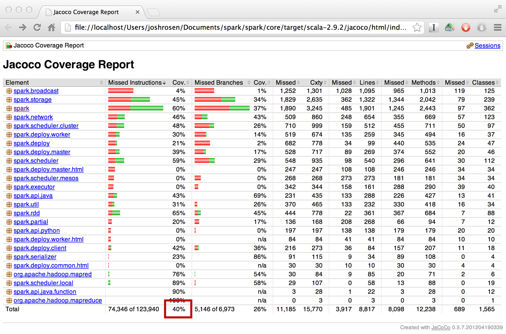
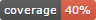

## Jacoco Code Coverage Badge [](http://doge.mit-license.org)

### Description

I needed something that will scrape the total percentage code coverage that was being displayed by a jacoco code coverage
report that was being hosted on a tomcat server into a shields.io badge. Then update a code coverage badge with the correct percentage that
was being displayed by the jacoco code coverage report so that I could put the badge in the README.md files of my software projects.

In essence I needed something that would take the data from the jacoco code coverage report (as seen in a the red box):



And turn it into a badge - that can be used in README.md files:



So this project does just that. It scrapes total code coverage precentage from a jacoco code coverage report on a given url
and creates a shields.io code coverage badge on a given port of the server and displays the correct percentage of code coverage
from the coverage report.

### Run with NodeJS

```
https://github.com/N7down/JacocoCodeCoverageBadge.git
cd JacocoCodeCoverageBadge
npm install
nodejs server.js -h or nodejs server.js [jacoco report url] [port (optional)]
```
### Run with NodeJS example

Executing the following will scrape total code coverage percentage from a jacoco code coverage report displayed at
http://localhost:8888 and run the nodejs server on port 8889. So when you navigate to http://localhost:8889 there
will be a badge with the current percentage of code coverage.

```
nodejs server.js http://localhost:8888/jacoco 8889
```

### Run with Docker

```
https://github.com/N7down/JacocoCodeCoverageBadge.git
cd JacocoCodeCoverageBadge
docker build -t n7down/jacoco-code-coverage-badge .
docker run -d --name jacoco-code-coverage-badge -p [port]:8080 -e JACOCO_URL='[jacoco report url]' n7down/jacoco-code-coverage-badge
```

### Run with Docker example

Executing the following with do the same thing as the "Run with NodeJS example" only with will run under a docker container.

```
docker run -d --name jacoco-code-coverage-badge -p 8889:8080 -e JACOCO_URL='http://localhost:8888/jacoco' n7down/jacoco-code-coverage-badge
```

Then by putting localhost:8889 into a README.md will propertly display the percentage total of code coverage for the project.

### Using the Jacoco Code Coverage Badge

After running examples in NodeJS or Docker browse to http://localhost:8889 in your browser you will see the jacoco
code coverage badge. You can then use http://localhost:8889 in the README.md to display the badge as you would use in any other badge.

For example add the following line to the README.md will add the jacoco code coverage badge to the README file of the project:

```
[]
```
